# algorithms-research

[](https://github.com/us-llm-engineer/algorithms-research/actions)
[](LICENSE)
[](https://en.cppreference.com/w/cpp/20)

Graduate-level algorithm and data-structure implementations in C++20, each paired with a rigorous complexity
and correctness write-up, a hard test suite (Catch2) and reproducible benchmarks against standard baselines.

Each module lives in `modules/<domain>/<name>/` and documents itself in eight sections: problem statement,
mathematical model and proofs, complexity table, quickstart, benchmarks, verification, trade-offs, references
(see [`docs/MODULE_TEMPLATE.md`](docs/MODULE_TEMPLATE.md)).

## Modules at a glance

Every module is benchmarked against **brute-force, baseline, near-optimal/heuristic and optimal** strategies on identical seeded inputs. Wall times are medians; "wins" and "loses" are reported as measured, including where the textbook-optimal algorithm is slower in practice.

| Module | Problem | Key bound | Strategies compared | Headline measured result |
| :--- | :--- | :--- | :--- | :--- |
| [fibonacci-heap](modules/data-structures/fibonacci-heap) | priority queue with `decrease_key` | $O(1)$ amortized decrease-key | binary heap, lazy-deletion heap | **loses**: 15.6x slower push/pop, 1.3x slower with heavy decrease-key at $n=2^{20}$ |
| [treap](modules/data-structures/treap) | ordered set + order statistics | $O(\log n)$ expected | sorted array, `std::set`, `std::unordered_set` | 5.6x faster than `std::set` on sorted inserts; up to 2x slower on random lookups |
| [skip-list](modules/data-structures/skip-list) | ordered set | $O(\log n)$ expected | same as treap | 2.2-3.2x slower than `std::set`; 1.5x faster on sorted inserts |
| [splay-tree](modules/data-structures/splay-tree) | self-adjusting ordered set | $O(\log n)$ amortized | same as treap | 19.6x faster sorted inserts, 1.4x faster skewed lookups, 2.5x slower uniform lookups |
| [persistent-tree](modules/data-structures/persistent-tree) | versioned ordered map | $O(\log n)$ per update | full copy per version, ephemeral map | 120x less memory and 1000x faster build than copying at $n=4096$ |
| [rank-select](modules/data-structures/rank-select) | succinct bit vector | $O(1)$ rank, 4% overhead | linear scan, prefix counters | about 100x faster than scanning at $n=2^{18}$; Fast layout 2.3x faster than Compact |
| [van-emde-boas](modules/data-structures/van-emde-boas) | integer predecessor search | $O(\log\log U)$ | bitmap scan, sorted array, `std::set` | 3.1x faster successor than `std::set` at $U=2^{24}$, on par with a static sorted array |
| [hopcroft-karp](modules/graph-flow/hopcroft-karp) | bipartite matching | $O(E\sqrt V)$ | greedy, Kuhn | 720x faster than Kuhn at $n=64000$; greedy reaches 87.6% of optimum |
| [push-relabel](modules/graph-flow/push-relabel) | maximum flow | $O(V^2\sqrt E)$ | Edmonds-Karp, Dinic, FIFO | Dinic fastest on the grid (5.6x over Edmonds-Karp); highest-label not fastest on sparse inputs |
| [tarjan-scc](modules/graph-flow/tarjan-scc) | strongly connected components | $O(V+E)$ | transitive closure, Kosaraju | 12x faster than closure at $n=1024$; ties with Kosaraju |
| [dp-optimization](modules/optimization/dp-optimization) | partition / interval-merge DP | $O(kn\log n)$, $O(n^2)$ | brute force, quadratic/cubic DP | 240x faster than the quadratic DP at $n=8192$ |
| [min-cost-flow](modules/optimization/min-cost-flow) | min-cost flow | $O(F\,E\log V)$ | Bellman-Ford SSP, SPFA SSP, greedy | on par with Bellman-Ford; **1.9x slower than SPFA** on sparse inputs |
| [simplex](modules/optimization/simplex) | linear programming | exponential worst case | vertex enumeration, greedy | 60,000x faster than enumeration at $n=10$; greedy reaches 52% of optimum at $n=256$ |
| [count-min](modules/sketches/count-min) | frequency estimation | $O(wd)$ memory | exact map, sort, Misra-Gries | 64 KiB vs 14 MB, 2x faster, about 2x overestimate on top keys |
| [hyperloglog](modules/sketches/hyperloglog) | distinct counting | $1.04/\sqrt{m}$ error | sort, hash set, linear counting | 191x faster than a hash set at 0.1% error (16 KiB); linear counting saturates |
| [christofides](modules/approximation/christofides) | metric TSP | $3/2$-approximation | brute force, Held-Karp, NN, double-tree, 2-opt | 2-opt gives better tours; Christofides is 3.4x faster than 2-opt at $n=256$ |

## Visualizations

All figures are generated from the CSV files named in their captions by `python3 tools/plot.py` (log-log median time versus input size; dashed = brute force, dotted = heuristic/approximation, bold = this module; quality plots divide the result by the exact or optimal reference, so 1.0 is optimal). Every module README embeds the full set for that module.

### Data structures

<!-- FIGURES:ROOT:data-structures -->
<table>
<tr><td width="50%">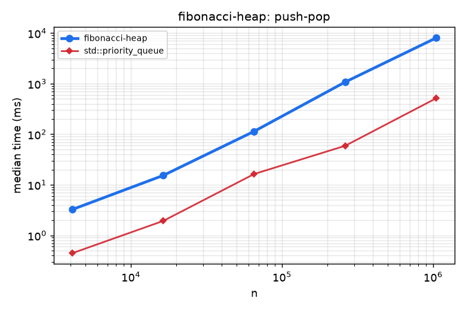<br><sub>Median time per strategy for n random keys pushed into an empty heap and then all popped (fibonacci-heap). At n = 1,048,576, fibonacci-heap is slowest at 8,019 ms; std::priority_queue is fastest at 513 ms. Source: data-structures/fibonacci-heap/results/bench.csv.</sub></td><td width="50%">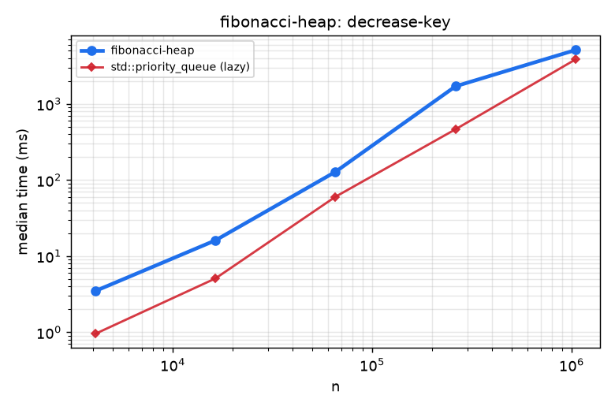<br><sub>fibonacci-heap: runtime on n pushes, n random decrease-keys, then all pops. Largest size n = 1,048,576: fibonacci-heap needs 5,104 ms against 3,844 ms for std::priority_queue (lazy).</sub></td></tr>
<tr><td width="50%">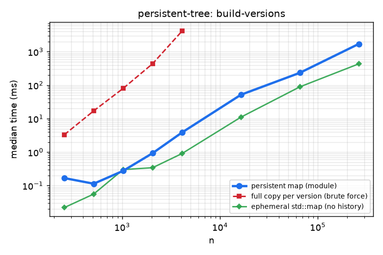<br><sub>persistent-tree: runtime on n updates, each creating a new version. Both axes are logarithmic. Largest size n = 262,144: persistent map (module) needs 1,703 ms against 433 ms for ephemeral std::map (no history). Data: data-structures/persistent-tree/results/bench.csv.</sub></td><td width="50%">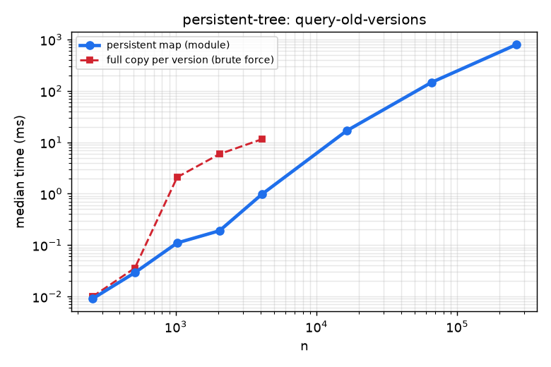<br><sub>How persistent-tree scales on n lookups against random past versions. Both axes are logarithmic. At n = 262,144, persistent map (module) takes 791 ms and is the only strategy run at that size.</sub></td></tr>
<tr><td width="50%">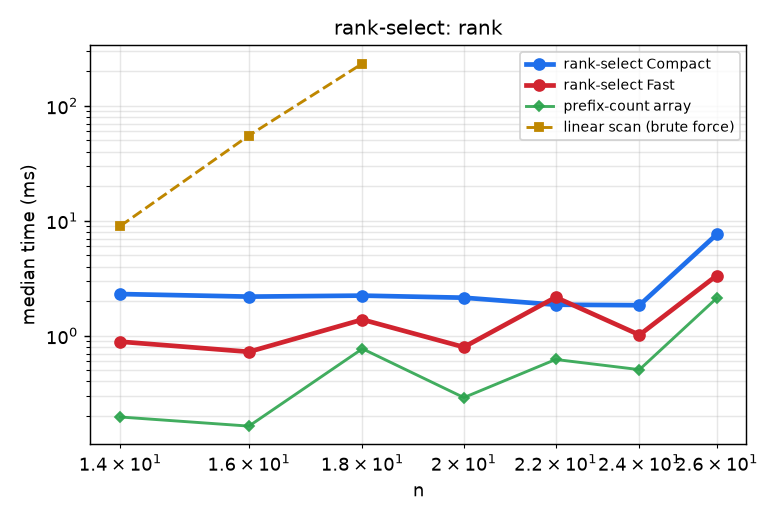<br><sub>Median time per strategy for 100,000 rank queries on 2^n random bits (rank-select). Both axes are logarithmic. At n = 26, rank-select Fast takes 3.33 ms (rank 2 of 3); prefix-count array is fastest at 2.12 ms.</sub></td><td width="50%">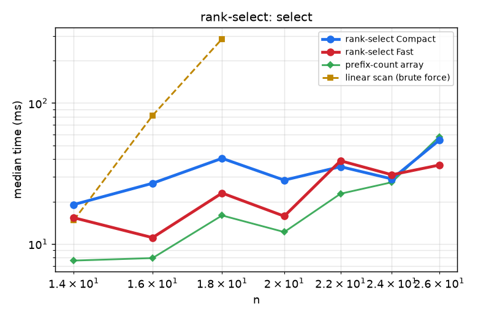<br><sub>How rank-select scales on 100,000 select queries on 2^n random bits. Both axes are logarithmic. At n = 26, rank-select Fast is fastest at 36.3 ms; prefix-count array is slowest at 57.6 ms. Source: data-structures/rank-select/results/bench.csv.</sub></td></tr>
<tr><td width="50%">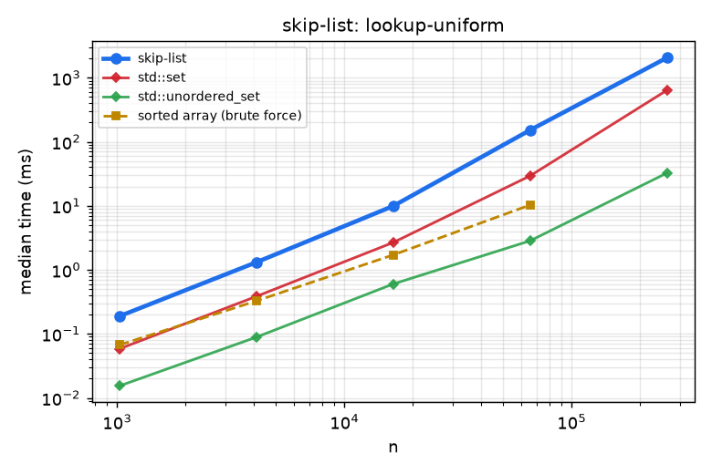<br><sub>How skip-list scales on n membership lookups for keys drawn uniformly from the stored set. Both axes are logarithmic. At n = 262,144, skip-list is slowest at 2,048 ms; std::unordered_set is fastest at 32.5 ms. Data: data-structures/skip-list/results/bench.csv.</sub></td><td width="50%">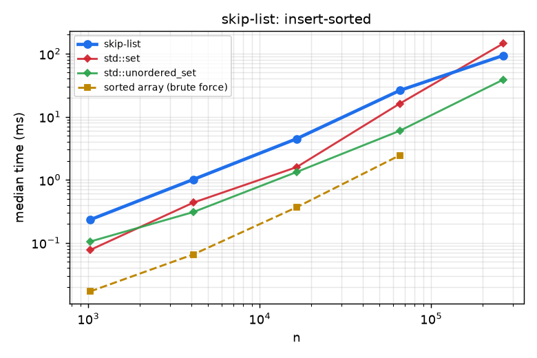<br><sub>Median time per strategy for n keys inserted in ascending order into an empty set (skip-list). Largest size n = 262,144: skip-list needs 93.2 ms, std::unordered_set only 38.5 ms and std::set 144 ms. Data: data-structures/skip-list/results/bench.csv.</sub></td></tr>
<tr><td width="50%">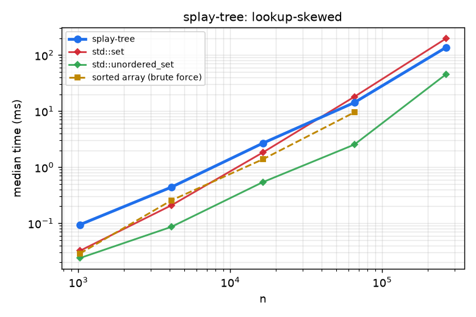<br><sub>splay-tree: runtime on n membership lookups where 90% of the queries hit the hottest 1% of the keys. Largest size n = 262,144: splay-tree needs 136 ms, std::unordered_set only 45 ms and std::set 196 ms. Source: data-structures/splay-tree/results/bench.csv.</sub></td><td width="50%">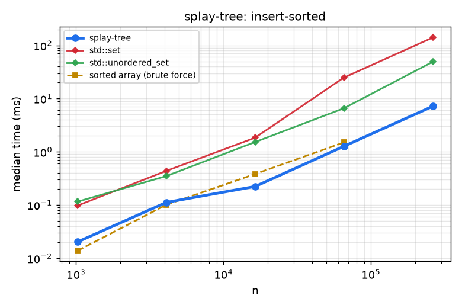<br><sub>splay-tree: runtime on n keys inserted in ascending order into an empty set. Largest size n = 262,144: splay-tree leads with 7.15 ms, std::set trails at 140 ms.</sub></td></tr>
<tr><td width="50%">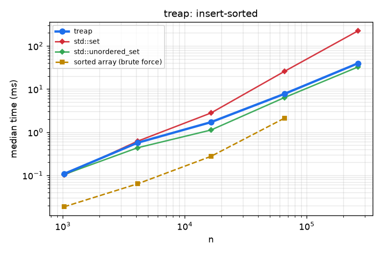<br><sub>treap: runtime on n keys inserted in ascending order into an empty set. At n = 262,144, treap takes 39.4 ms (rank 2 of 3); std::unordered_set is fastest at 32.3 ms. Source: data-structures/treap/results/bench.csv.</sub></td><td width="50%">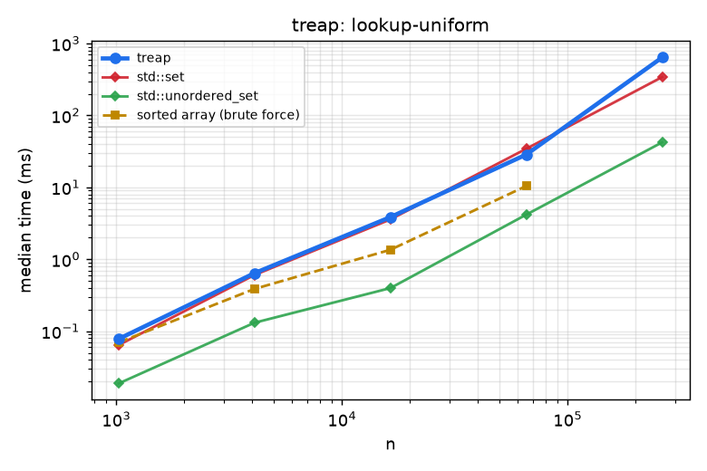<br><sub>Median time per strategy for n membership lookups for keys drawn uniformly from the stored set (treap). At n = 262,144, treap is slowest at 639 ms; std::unordered_set is fastest at 42.2 ms.</sub></td></tr>
<tr><td width="50%">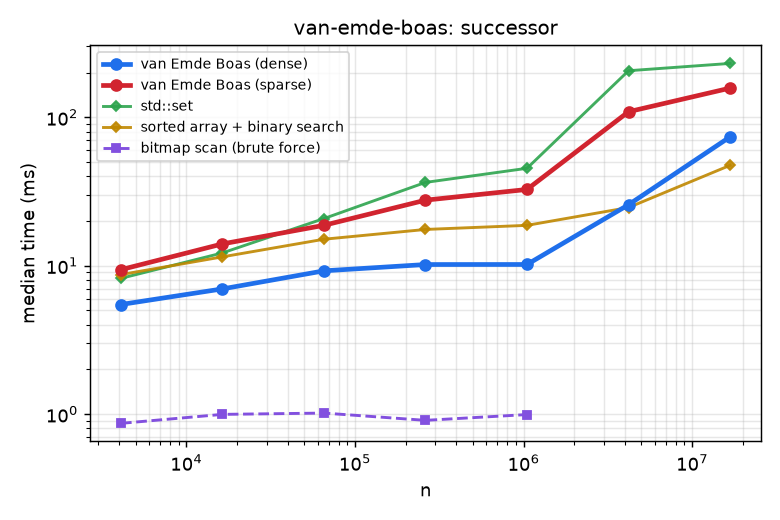<br><sub>van-emde-boas: runtime on 200,000 successor queries over U = n integers holding U/16 keys. Largest size n = 16,777,216: van Emde Boas (dense) needs 73.7 ms, sorted array + binary search only 47.4 ms and std::set 230 ms. Source: data-structures/van-emde-boas/results/bench.csv.</sub></td><td width="50%">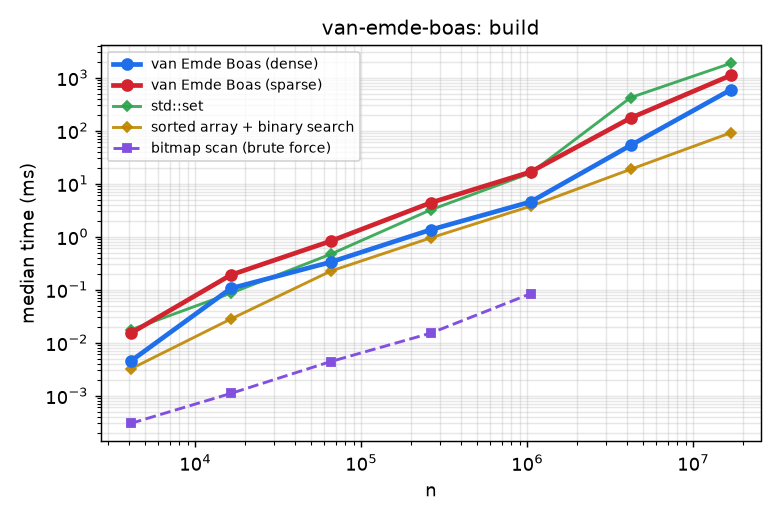<br><sub>van-emde-boas: runtime on building from U/16 random keys in a universe of U = n. Largest size n = 16,777,216: van Emde Boas (dense) needs 586 ms, sorted array + binary search only 90.7 ms and std::set 1,851 ms.</sub></td></tr>
</table>
<!-- /FIGURES -->

### Graph algorithms and flows

<!-- FIGURES:ROOT:graph-flow -->
<table>
<tr><td width="50%">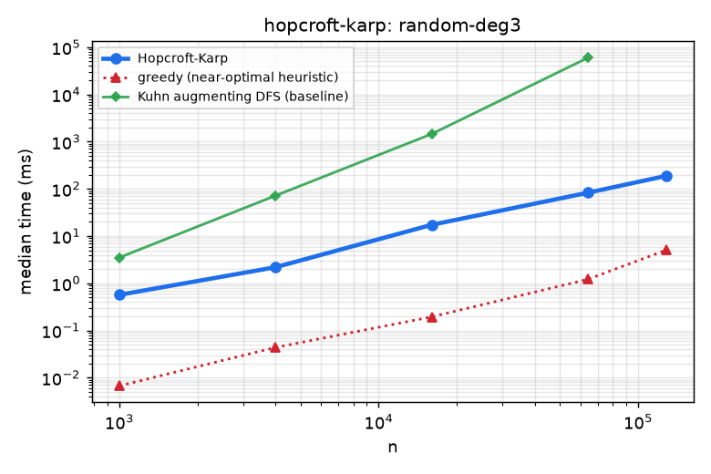<br><sub>How hopcroft-karp scales on random bipartite graphs, three edges per left vertex. Both axes are logarithmic. At n = 128,000, Hopcroft-Karp is slowest at 188 ms; greedy (near-optimal heuristic) is fastest at 5.04 ms.</sub></td><td width="50%">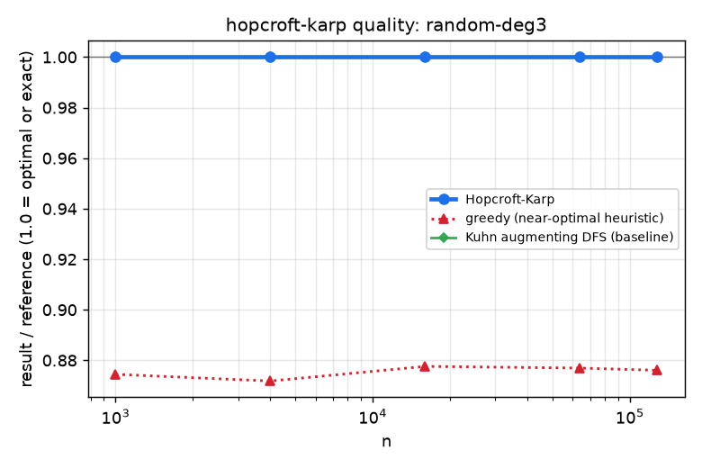<br><sub>hopcroft-karp: result quality on random bipartite graphs, three edges per left vertex. At n = 128,000, Hopcroft-Karp scores 1.000; greedy (near-optimal heuristic) is furthest from 1.0 at 0.876. Source: graph-flow/hopcroft-karp/results/bench.csv.</sub></td></tr>
<tr><td width="50%">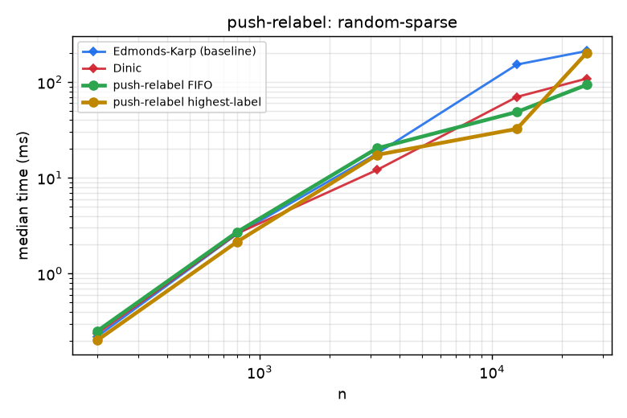<br><sub>How push-relabel scales on sparse random networks, about five arcs per vertex. At n = 25,600, push-relabel FIFO is fastest at 93.6 ms; Edmonds-Karp (baseline) is slowest at 211 ms.</sub></td><td width="50%">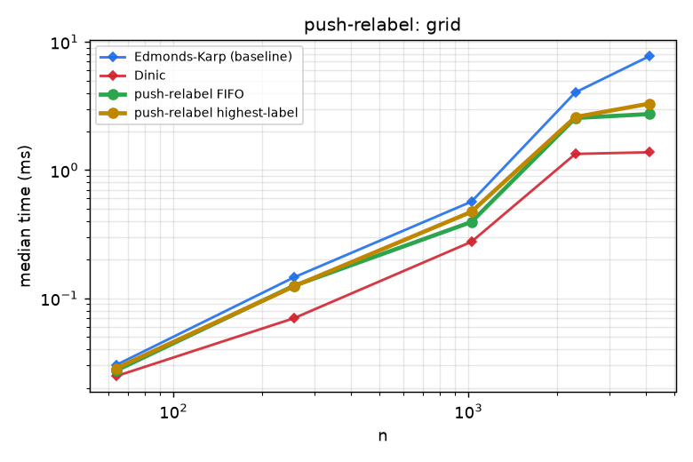<br><sub>push-relabel: runtime on grid networks with n = k*k vertices. Both axes are logarithmic. Largest size n = 4,096: push-relabel FIFO needs 2.73 ms, Dinic only 1.38 ms and Edmonds-Karp (baseline) 7.71 ms. Source: graph-flow/push-relabel/results/bench.csv.</sub></td></tr>
<tr><td width="50%">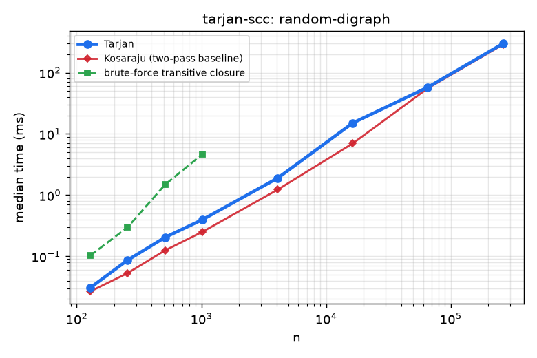<br><sub>How tarjan-scc scales on random directed graphs with n vertices and 1.5n edges. At n = 262,144, Tarjan is slowest at 298 ms; Kosaraju (two-pass baseline) is fastest at 287 ms. Source: graph-flow/tarjan-scc/results/bench.csv.</sub></td><td width="50%"></td></tr>
</table>
<!-- /FIGURES -->

### Optimization

<!-- FIGURES:ROOT:optimization -->
<table>
<tr><td width="50%">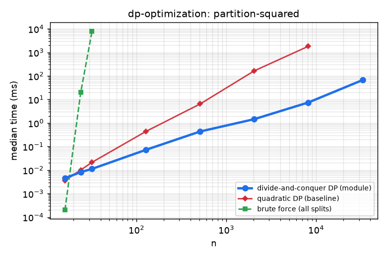<br><sub>dp-optimization: runtime on splitting n numbers into 16 segments of minimal squared sums. Both axes are logarithmic. Largest size n = 32,768: only divide-and-conquer DP (module) was run, taking 66.4 ms.</sub></td><td width="50%">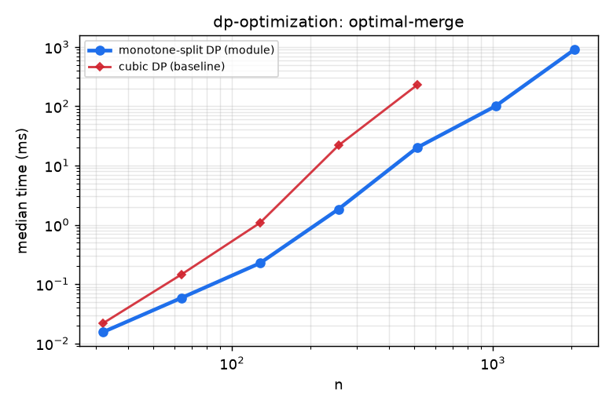<br><sub>dp-optimization: runtime on optimal adjacent merging of n weights. Log-log axes; dashed is brute force, dotted is heuristic, bold is this module. Largest size n = 2,048: only monotone-split DP (module) was run, taking 897 ms. Source: optimization/dp-optimization/results/bench.csv.</sub></td></tr>
<tr><td width="50%">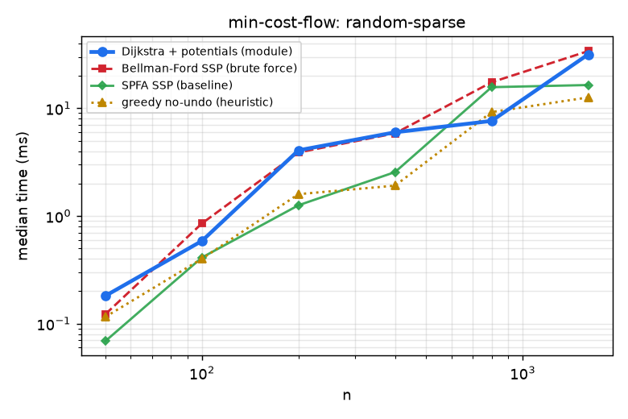<br><sub>min-cost-flow: runtime on sparse random networks requesting 0.3n + 5 units of flow. Largest size n = 1,600: Dijkstra + potentials (module) needs 31.6 ms, greedy no-undo (heuristic) only 12.6 ms and Bellman-Ford SSP (brute force) 34 ms. Source: optimization/min-cost-flow/results/bench.csv.</sub></td><td width="50%">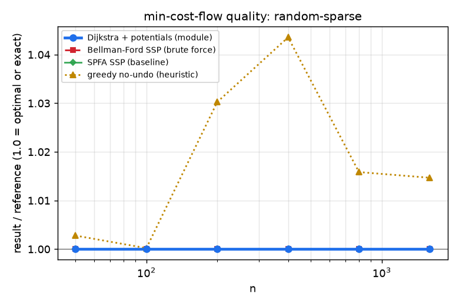<br><sub>min-cost-flow: result quality on sparse random networks requesting 0.3n + 5 units of flow. At n = 1,600, Dijkstra + potentials (module) scores 1.000; greedy no-undo (heuristic) is furthest from 1.0 at 1.015.</sub></td></tr>
<tr><td width="50%">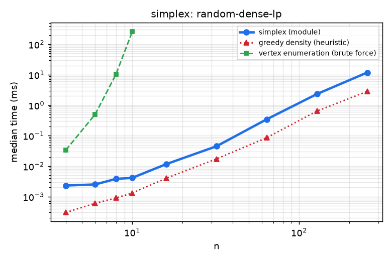<br><sub>simplex: runtime on random dense linear programs with n variables and n constraints. Both axes are logarithmic. Largest size n = 256: simplex (module) needs 11.8 ms against 2.84 ms for greedy density (heuristic). Data: optimization/simplex/results/bench.csv.</sub></td><td width="50%">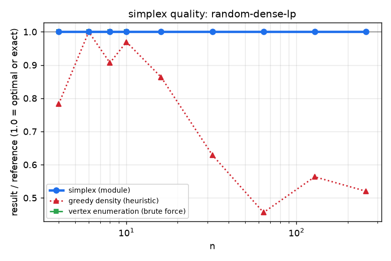<br><sub>Quality versus the exact reference for random dense linear programs with n variables and n constraints (simplex). 1.0 means optimal. At n = 256, simplex (module) scores 1.000; greedy density (heuristic) is furthest from 1.0 at 0.520. Source: optimization/simplex/results/bench.csv.</sub></td></tr>
</table>
<!-- /FIGURES -->

### Streaming sketches

<!-- FIGURES:ROOT:sketches -->
<table>
<tr><td width="50%">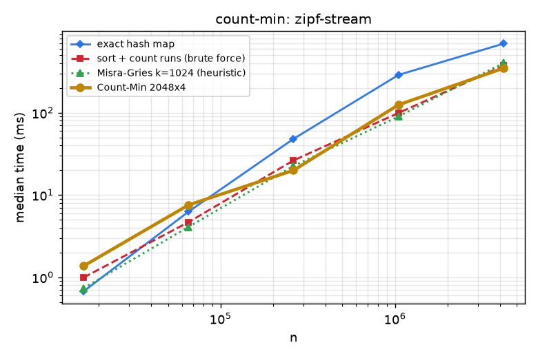<br><sub>Median time per strategy for a Zipf(1.1) stream of n items over n/4 distinct keys (count-min). At n = 4,194,304, Count-Min 2048x4 is fastest at 347 ms; exact hash map is slowest at 689 ms.</sub></td><td width="50%">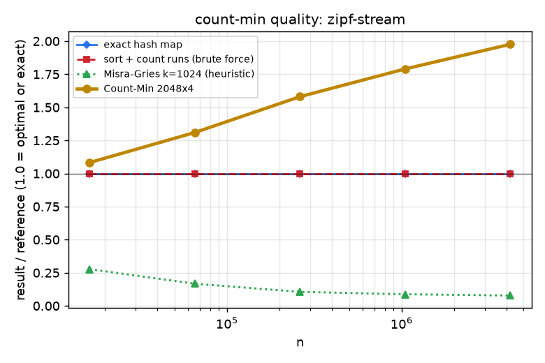<br><sub>count-min: result quality on a Zipf(1.1) stream of n items over n/4 distinct keys. At n = 4,194,304, Count-Min 2048x4 scores 1.976; Count-Min 2048x4 is furthest from 1.0 at 1.976. Data: sketches/count-min/results/bench.csv.</sub></td></tr>
<tr><td width="50%">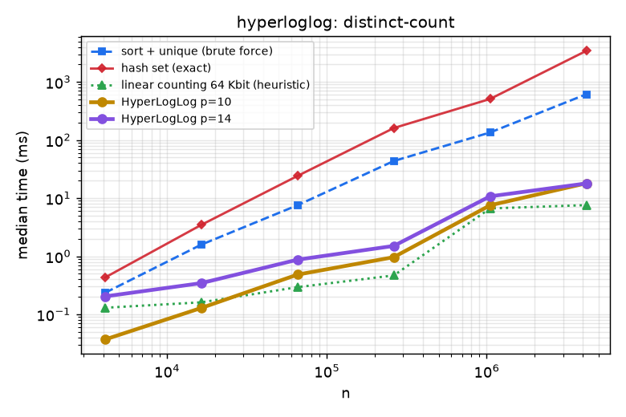<br><sub>hyperloglog: runtime on a stream of n items containing n/2 distinct values. Both axes are logarithmic. Largest size n = 4,194,304: HyperLogLog p=14 needs 17.9 ms, linear counting 64 Kbit (heuristic) only 7.59 ms and hash set (exact) 3,427 ms.</sub></td><td width="50%">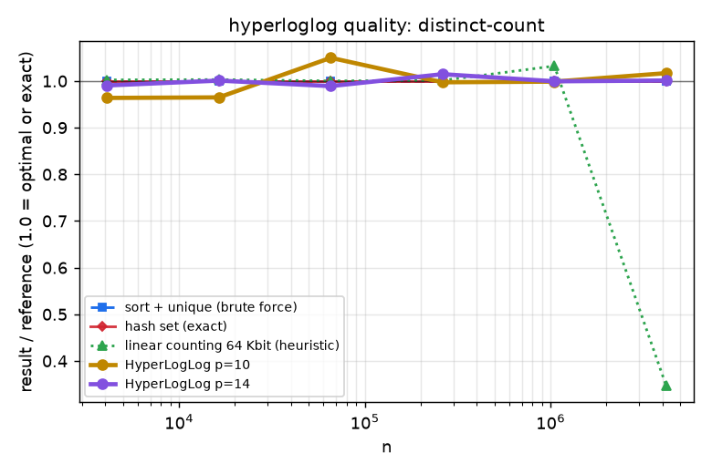<br><sub>How close each hyperloglog strategy gets to optimal on a stream of n items containing n/2 distinct values. Largest size n = 4,194,304: HyperLogLog p=10 reaches 1.017 while linear counting 64 Kbit (heuristic) lands at 0.347. Data: sketches/hyperloglog/results/bench.csv.</sub></td></tr>
</table>
<!-- /FIGURES -->

### Approximation algorithms

<!-- FIGURES:ROOT:approximation -->
<table>
<tr><td width="50%">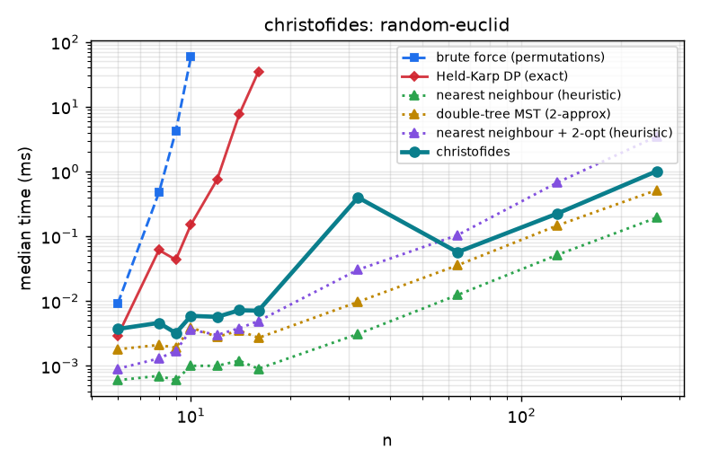<br><sub>How christofides scales on random Euclidean TSP instances with n cities in the unit square. Largest size n = 256: christofides needs 1.01 ms, nearest neighbour (heuristic) only 0.194 ms and nearest neighbour + 2-opt (heuristic) 3.47 ms.</sub></td><td width="50%">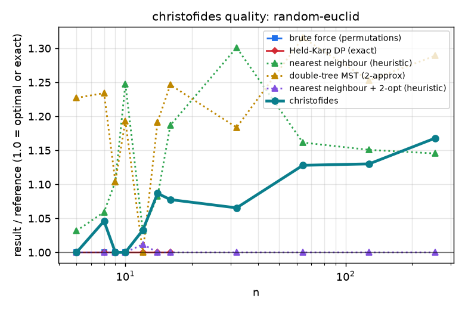<br><sub>Quality versus the exact reference for random Euclidean TSP instances with n cities in the unit square (christofides). 1.0 means optimal. At n = 256, christofides scores 1.168; double-tree MST (2-approx) is furthest from 1.0 at 1.289. Data: approximation/christofides/results/bench.csv.</sub></td></tr>
</table>
<!-- /FIGURES -->

## Build and test

Requirements: a C++20 compiler (GCC 11+), CMake >= 3.25, Ninja and [vcpkg](https://vcpkg.io) (Catch2 is the only dependency and is installed in manifest mode from `vcpkg.json`).

```bash
export VCPKG_ROOT=$HOME/vcpkg                    # your vcpkg checkout
cmake --preset debug-asan                        # Debug + AddressSanitizer + UBSan
cmake --build --preset debug-asan
ctest --preset debug-asan                        # all tests run under the sanitizers
cmake --preset release && cmake --build --preset release   # -O3 plus benchmark executables
```

Randomized tests are seeded; a failure prints its seed. Re-run with `ALGO_TEST_SEED=<n>` to explore other inputs.

## Layout

```
common/      seeded RNG, benchmark harness, test helpers (header-only)
modules/     one directory per algorithm: include/, tests/, bench/, results/, README.md
tools/       mutation checker (mutate.py), CSV -> README tables (render_tables.py), plots (plot.py)
```

Benchmarks write CSV files to each module's `results/`; the tables in the READMEs are generated from those files.

## Reproducing the benchmarks

```bash
python3 tools/run_benchmarks.py      # release build, all benchmarks -> modules/*/results/bench.csv, README tables
python3 tools/plot.py                # CSV -> modules/*/results/figures/*.png and the figure galleries
```

Requirements: GCC 11+, CMake >= 3.25, Ninja, vcpkg (Catch2), Python 3 with `matplotlib`. Reference machine for the committed numbers: Intel Core i7-10750H @ 2.60 GHz, 7 GiB RAM, GCC 11.5 `-O3`, one thread. Absolute times vary by machine; the *ratios* between strategies are the reproducible result. The full sweep takes roughly 20 minutes, dominated by the intentionally slow brute-force baselines.

## Limitations

* Benchmarks use synthetic seeded inputs (random, Zipf, grid, staircase); they do not stand in for application workloads. Several sweeps (max flow, matching "staircase") are not adversarial for the baselines, and each module README says so.
* Single-instance quality figures (TSP, LP) are noisy; they illustrate the trade-off rather than estimate averages.
* Timings are single-threaded wall-clock medians on one laptop-class CPU.

## References

* T. H. Cormen, C. E. Leiserson, R. L. Rivest, C. Stein, *Introduction to Algorithms*, 3rd ed., MIT Press, 2009.
* D. E. Knuth, *The Art of Computer Programming*, Addison-Wesley.
* Per-algorithm primary sources are cited in section 8 of each module README.
