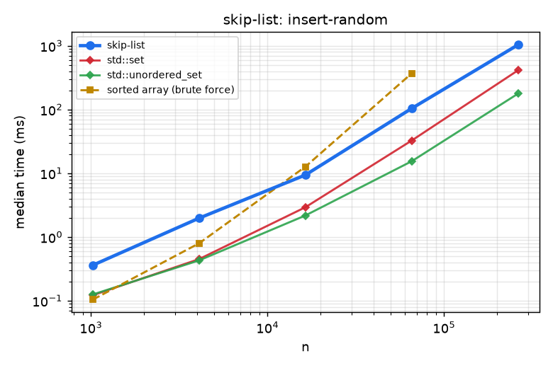
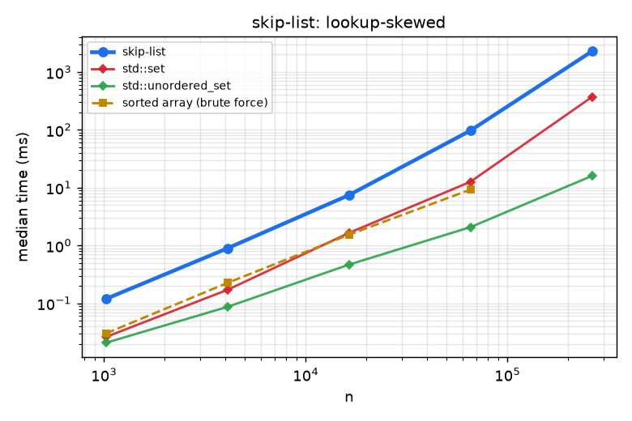
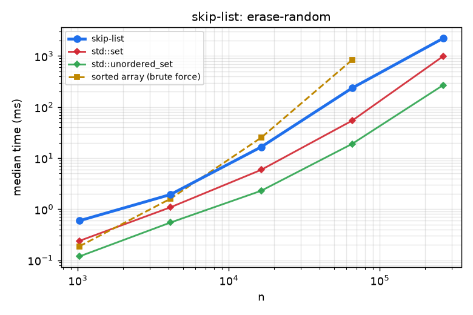

# Skip list

A randomized layered linked list giving expected $O(\log n)$ search, insert and erase without rotations.

## 1. Problem Statement

* **Input**: distinct keys under a strict weak order; operations `insert`, `erase`, `contains`, `to_vector`.
* **Output**: set semantics; `to_vector` returns keys in sorted order.
* **Constraints**: reproducible per seed; node storage is a single arena.

## 2. Algorithm Overview & Mathematical Model

Level 0 is a sorted linked list. Each node is promoted to level $i+1$ with probability $p=1/4$ (the implementation promotes while two random bits are zero), so level $i$ holds about $n p^i$ nodes. A search descends from the top level, moving right while the next key is smaller, then down. Expected search path length is $O(\log_{{1/p}} n)$ (Pugh, 1990) and the expected number of pointers per node is $1/(1-p)=4/3$.

## 3. Complexity Analysis

| Operation / phase | Time | Space / notes |
| :--- | :--- | :--- |
| `contains`, `insert`, `erase` | $O(\log n)$ expected, $O(n)$ worst | |
| `to_vector` | $O(n)$ | |
| Storage | | $O(n)$ expected, about $4/3$ pointers per node |

## 4. Quickstart & Usage

Header-only; add `modules/data-structures/skip-list/include` to the include path (CMake target `skip_list`).

```cpp
#include "skip_list.hpp"

algo::SkipList<int> s(/*seed=*/7);
s.insert(5); s.insert(1); s.insert(9);
s.contains(5);           // true
auto sorted = s.to_vector();   // {1, 5, 9}
```

## 5. Empirical Benchmarks

Measured on an Intel Core i7-10750H @ 2.60 GHz (12 threads), 7 GiB RAM, GCC 11.5 `-O3`, single thread. Each cell is the median of 3-9 repetitions after one warm-up; inputs are seeded (`common/rng.hpp`) so every run sees identical data. Regenerate with `python3 tools/run_benchmarks.py && python3 tools/plot.py`.

**Strategies compared** (brute force, baseline, near-optimal heuristic and optimal/exact tiers, all on the same inputs):

| Tier | Strategy |
| :--- | :--- |
| Brute force | sorted array: binary-search lookup, $O(n)$ shifting insert/erase (shown up to $n=2^{16}$) |
| Baseline | `std::set` (red-black tree) |
| Non-ordered upper bound | `std::unordered_set` (hash table: fastest lookup, but no order queries) |
| This module | `skip-list` |

### Random inserts

<!-- BENCH:results/bench.csv workload=insert-random -->
| n | skip-list | std::set | std::unordered_set | sorted array (brute force) |
| ---: | ---: | ---: | ---: | ---: |
| 1,024 | 0.361 | 0.122 | 0.125 | 0.104 |
| 4,096 | 1.976 | 0.450 | 0.430 | 0.796 |
| 16,384 | 9.393 | 2.928 | 2.174 | 12.662 |
| 65,536 | 103.880 | 32.566 | 15.410 | 368.441 |
| 262,144 | 1033.212 | 411.355 | 177.018 |  |

_Median wall time in milliseconds._
<!-- /BENCH -->

### Ascending inserts

<!-- BENCH:results/bench.csv workload=insert-sorted -->
| n | skip-list | std::set | std::unordered_set | sorted array (brute force) |
| ---: | ---: | ---: | ---: | ---: |
| 1,024 | 0.232 | 0.077 | 0.104 | 0.017 |
| 4,096 | 1.010 | 0.434 | 0.307 | 0.065 |
| 16,384 | 4.461 | 1.581 | 1.324 | 0.365 |
| 65,536 | 26.061 | 16.119 | 5.976 | 2.440 |
| 262,144 | 93.208 | 144.036 | 38.498 |  |

_Median wall time in milliseconds._
<!-- /BENCH -->

### Uniform lookups

<!-- BENCH:results/bench.csv workload=lookup-uniform -->
| n | skip-list | std::set | std::unordered_set | sorted array (brute force) |
| ---: | ---: | ---: | ---: | ---: |
| 1,024 | 0.189 | 0.058 | 0.015 | 0.067 |
| 4,096 | 1.311 | 0.385 | 0.089 | 0.327 |
| 16,384 | 9.913 | 2.671 | 0.601 | 1.709 |
| 65,536 | 151.954 | 29.288 | 2.837 | 10.287 |
| 262,144 | 2048.185 | 636.402 | 32.453 |  |

_Median wall time in milliseconds._
<!-- /BENCH -->

### Skewed lookups (90% on the hottest 1% of keys)

<!-- BENCH:results/bench.csv workload=lookup-skewed -->
| n | skip-list | std::set | std::unordered_set | sorted array (brute force) |
| ---: | ---: | ---: | ---: | ---: |
| 1,024 | 0.119 | 0.026 | 0.021 | 0.030 |
| 4,096 | 0.895 | 0.171 | 0.087 | 0.226 |
| 16,384 | 7.450 | 1.651 | 0.467 | 1.539 |
| 65,536 | 97.218 | 12.644 | 2.077 | 9.265 |
| 262,144 | 2281.073 | 370.051 | 15.961 |  |

_Median wall time in milliseconds._
<!-- /BENCH -->

### Insert all then erase all

<!-- BENCH:results/bench.csv workload=erase-random -->
| n | skip-list | std::set | std::unordered_set | sorted array (brute force) |
| ---: | ---: | ---: | ---: | ---: |
| 1,024 | 0.593 | 0.239 | 0.118 | 0.187 |
| 4,096 | 1.927 | 1.084 | 0.545 | 1.593 |
| 16,384 | 16.526 | 5.890 | 2.291 | 25.147 |
| 65,536 | 235.563 | 54.123 | 18.976 | 837.495 |
| 262,144 | 2211.318 | 984.631 | 267.788 |  |

_Median wall time in milliseconds._
<!-- /BENCH -->

### Figures

Dashed lines are brute-force strategies, dotted lines are heuristics or approximations, solid bold is this module. Axes are log-log; quality plots show result divided by the exact/optimal reference (1.0 is optimal).

<!-- FIGURES:results/bench.csv -->
<table>
<tr><td width="50%"><br><sub>insert-random (results/bench.csv)</sub></td><td width="50%"><br><sub>insert-sorted (results/bench.csv)</sub></td></tr>
<tr><td width="50%"><br><sub>lookup-uniform (results/bench.csv)</sub></td><td width="50%"><br><sub>lookup-skewed (results/bench.csv)</sub></td></tr>
<tr><td width="50%"><br><sub>erase-random (results/bench.csv)</sub></td><td width="50%"></td></tr>
</table>
<!-- /FIGURES -->

### Findings

* **Honest result**: this skip list is 2.2-3.2x slower than `std::set` on random inserts, erases and lookups at $n=2^{18}$. Each node owns a `std::vector` of next-pointers, which costs an extra allocation and a cache miss per node; pointer chasing over $\approx\log_4 n$ levels is also less cache-friendly than a balanced tree.
* It does win on ascending inserts at large $n$ (about 1.5x faster than `std::set`) and has no rebalancing logic.
* The sorted-array brute force beats it on lookups (10 ms vs 152 ms at $n=2^{16}$, the largest size it was run at), a reminder that for static data a plain array is hard to beat.

Raw data: [`results/bench.csv`](results/bench.csv). Benchmark source: [`bench/skip_list_bench.cpp`](bench/skip_list_bench.cpp).

## 6. Correctness & Verification

The Catch2 suite (16 cases) covers ordered, reverse and alternating insertion, randomized set equivalence, empty/singleton/duplicate/absent-erase edge cases, erase back to empty with reuse, seed determinism, extreme signed keys, `check_invariants()` after every mixed operation, logarithmic height on sorted and reverse insertion, a duplicate flood, clear/rebuild cycles, and node-capacity reuse after erase.

```bash
cmake --preset debug-asan && cmake --build --preset debug-asan --target skip_list_test
./build/debug-asan/mod_skip-list/skip_list_test
```

## 7. Limitations & Trade-Offs

* Expected-case guarantees only.
* Per-node `std::vector` storage makes it slower and larger than array-backed alternatives; a flat tower layout would be the first optimization.
* No order-statistic or range queries beyond `to_vector`.

## 8. References

* W. Pugh, “Skip lists: a probabilistic alternative to balanced trees,” *Communications of the ACM* 33(6), 1990.
