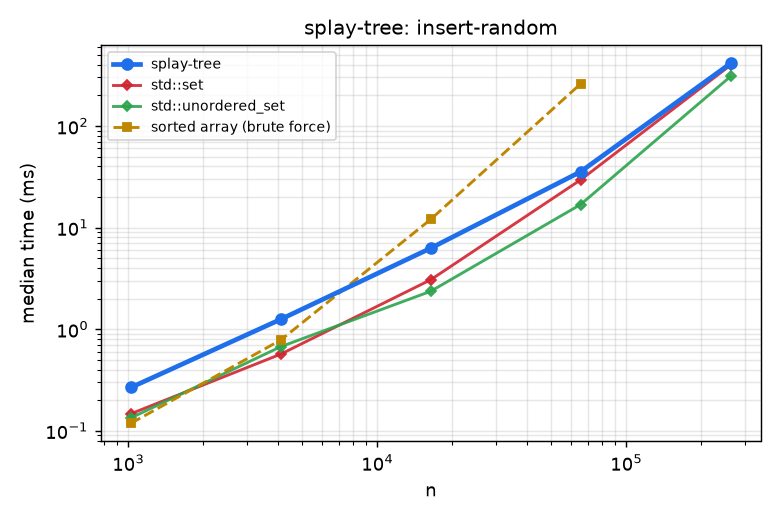
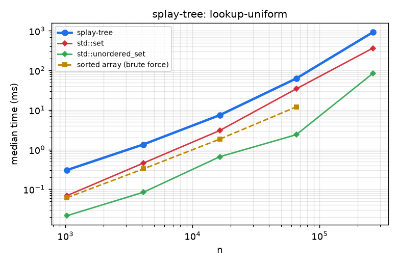
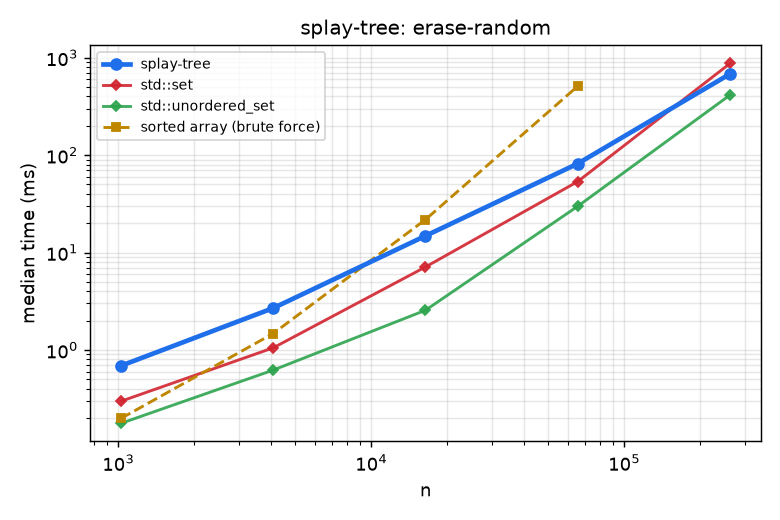

# Splay tree

A self-adjusting BST with amortized $O(\log n)$ operations and the working-set property: recently accessed keys are cheap to find again.

## 1. Problem Statement

* **Input**: distinct keys under a strict weak order; `insert`, `erase`, `contains`, `lower_bound`, `upper_bound`, `predecessor`, `min`, `max`.
* **Output**: set semantics. Note that queries **mutate** the tree (they splay), so they are non-`const`.
* **Constraints**: array arena with parent links; no recursion in the hot path.

## 2. Algorithm Overview & Mathematical Model

Every access splays the touched node to the root using zig, zig-zig and zig-zag rotations. With the potential $\Phi=\sum_v \log_2 s(v)$ ($s(v)$ = subtree size), an access costs $3(\log_2 n)+1$ amortized, so any sequence of $m$ operations costs $O(m\log n)$. Stronger theorems (static optimality, working set, sequential access) say splaying matches the best static tree on skewed access distributions and handles sorted access in $O(1)$ per element amortized.

## 3. Complexity Analysis

| Operation / phase | Time | Space / notes |
| :--- | :--- | :--- |
| any single operation | $O(n)$ worst, $O(\log n)$ amortized | |
| $m$ operations | $O(m \log n)$ | |
| sequential access | $O(1)$ amortized each | |
| Storage | | $O(n)$, two child links + one parent link per node |

## 4. Quickstart & Usage

Header-only; add `modules/data-structures/splay-tree/include` to the include path (CMake target `splay_tree`).

```cpp
#include "splay_tree.hpp"

algo::SplayTree<int> t;
t.insert(3); t.insert(1); t.insert(2);
t.contains(2);                 // true, and 2 is now the root
auto next = t.lower_bound(2);  // std::optional<int>
```

## 5. Empirical Benchmarks

Measured on an Intel Core i7-10750H @ 2.60 GHz (12 threads), 7 GiB RAM, GCC 11.5 `-O3`, single thread. Each cell is the median of 3-9 repetitions after one warm-up; inputs are seeded (`common/rng.hpp`) so every run sees identical data. Regenerate with `python3 tools/run_benchmarks.py && python3 tools/plot.py`.

**Strategies compared** (brute force, baseline, near-optimal heuristic and optimal/exact tiers, all on the same inputs):

| Tier | Strategy |
| :--- | :--- |
| Brute force | sorted array: binary-search lookup, $O(n)$ shifting insert/erase (shown up to $n=2^{16}$) |
| Baseline | `std::set` (red-black tree) |
| Non-ordered upper bound | `std::unordered_set` (hash table: fastest lookup, but no order queries) |
| This module | `splay-tree` |

### Random inserts

<!-- BENCH:results/bench.csv workload=insert-random -->
| n | splay-tree | std::set | std::unordered_set | sorted array (brute force) |
| ---: | ---: | ---: | ---: | ---: |
| 1,024 | 0.266 | 0.147 | 0.134 | 0.118 |
| 4,096 | 1.250 | 0.568 | 0.672 | 0.782 |
| 16,384 | 6.264 | 3.062 | 2.358 | 12.032 |
| 65,536 | 35.433 | 29.468 | 16.856 | 259.681 |
| 262,144 | 412.604 | 396.470 | 307.007 |  |

_Median wall time in milliseconds._
<!-- /BENCH -->

### Ascending inserts

<!-- BENCH:results/bench.csv workload=insert-sorted -->
| n | splay-tree | std::set | std::unordered_set | sorted array (brute force) |
| ---: | ---: | ---: | ---: | ---: |
| 1,024 | 0.020 | 0.097 | 0.115 | 0.014 |
| 4,096 | 0.112 | 0.437 | 0.349 | 0.101 |
| 16,384 | 0.223 | 1.839 | 1.524 | 0.382 |
| 65,536 | 1.268 | 24.786 | 6.574 | 1.500 |
| 262,144 | 7.150 | 140.032 | 48.985 |  |

_Median wall time in milliseconds._
<!-- /BENCH -->

### Uniform lookups

<!-- BENCH:results/bench.csv workload=lookup-uniform -->
| n | splay-tree | std::set | std::unordered_set | sorted array (brute force) |
| ---: | ---: | ---: | ---: | ---: |
| 1,024 | 0.304 | 0.069 | 0.021 | 0.061 |
| 4,096 | 1.349 | 0.456 | 0.084 | 0.326 |
| 16,384 | 7.434 | 3.041 | 0.662 | 1.842 |
| 65,536 | 62.689 | 34.275 | 2.383 | 11.994 |
| 262,144 | 916.326 | 364.027 | 83.830 |  |

_Median wall time in milliseconds._
<!-- /BENCH -->

### Skewed lookups (90% on the hottest 1% of keys)

<!-- BENCH:results/bench.csv workload=lookup-skewed -->
| n | splay-tree | std::set | std::unordered_set | sorted array (brute force) |
| ---: | ---: | ---: | ---: | ---: |
| 1,024 | 0.094 | 0.032 | 0.024 | 0.029 |
| 4,096 | 0.440 | 0.208 | 0.086 | 0.256 |
| 16,384 | 2.674 | 1.828 | 0.541 | 1.382 |
| 65,536 | 14.173 | 17.977 | 2.525 | 9.476 |
| 262,144 | 135.745 | 195.556 | 45.030 |  |

_Median wall time in milliseconds._
<!-- /BENCH -->

### Insert all then erase all

<!-- BENCH:results/bench.csv workload=erase-random -->
| n | splay-tree | std::set | std::unordered_set | sorted array (brute force) |
| ---: | ---: | ---: | ---: | ---: |
| 1,024 | 0.688 | 0.298 | 0.177 | 0.198 |
| 4,096 | 2.690 | 1.052 | 0.622 | 1.476 |
| 16,384 | 14.829 | 7.114 | 2.557 | 21.796 |
| 65,536 | 81.764 | 53.565 | 29.858 | 510.275 |
| 262,144 | 681.226 | 872.800 | 413.850 |  |

_Median wall time in milliseconds._
<!-- /BENCH -->

### Figures

Dashed lines are brute-force strategies, dotted lines are heuristics or approximations, solid bold is this module. Axes are log-log; quality plots show result divided by the exact/optimal reference (1.0 is optimal).

<!-- FIGURES:results/bench.csv -->
<table>
<tr><td width="50%"><br><sub>insert-random (results/bench.csv)</sub></td><td width="50%"><br><sub>insert-sorted (results/bench.csv)</sub></td></tr>
<tr><td width="50%"><br><sub>lookup-uniform (results/bench.csv)</sub></td><td width="50%"><br><sub>lookup-skewed (results/bench.csv)</sub></td></tr>
<tr><td width="50%"><br><sub>erase-random (results/bench.csv)</sub></td><td width="50%"></td></tr>
</table>
<!-- /FIGURES -->

### Findings

* **Skewed lookups: the splay tree beats `std::set`** (about 1.4x at $n=2^{18}$) because hot keys sit near the root (working-set property), though the sorted-array and hash table still win.
* **Ascending inserts: about 20x faster than `std::set`** (7 ms vs 140 ms at $n=2^{18}$): each insert lands next to the root.
* On uniform random lookups it is about 2.5x *slower* than `std::set`: every read pays for rotations.
* Because reads write, it is unsuitable for concurrent readers.

Raw data: [`results/bench.csv`](results/bench.csv). Benchmark source: [`bench/splay_tree_bench.cpp`](bench/splay_tree_bench.cpp).

## 6. Correctness & Verification

The Catch2 suite (16 cases) covers a worked example, edge cases, random operations against `std::set` (300 seeds), custom comparators, erase at every position, a $10^6$-node path (no stack overflow), and invariants after every operation. Rotation accounting checks the textbook theorems: depth halving along the access path, sequential access $O(n)$, the balance theorem $\le 3m\lg n+m+n\lg n$, static optimality on skewed access and the dynamic finger property.

```bash
cmake --preset debug-asan && cmake --build --preset debug-asan --target splay_tree_test
./build/debug-asan/mod_splay-tree/splay_tree_test
```

## 7. Limitations & Trade-Offs

* Single operations can cost $O(n)$; only amortized bounds hold.
* Reads mutate the structure, so no `const` queries and no safe concurrent readers.
* Slower than `std::set` for uniformly random access.

## 8. References

* D. D. Sleator and R. E. Tarjan, “Self-adjusting binary search trees,” *J. ACM* 32(3), 1985.
