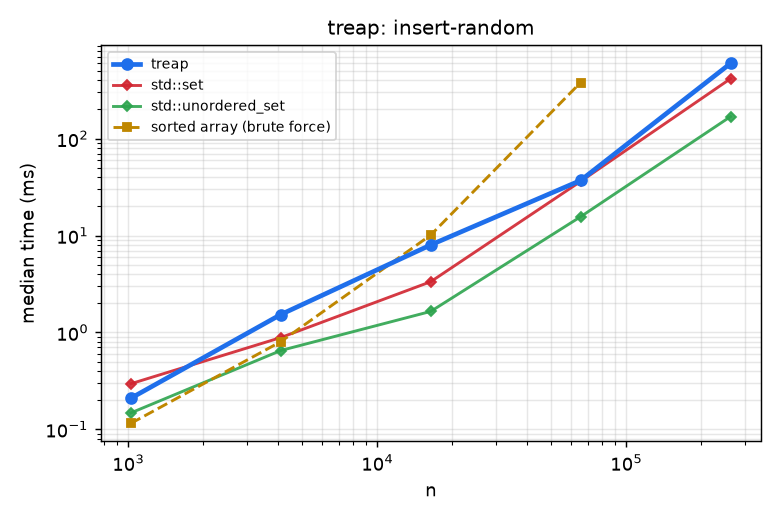
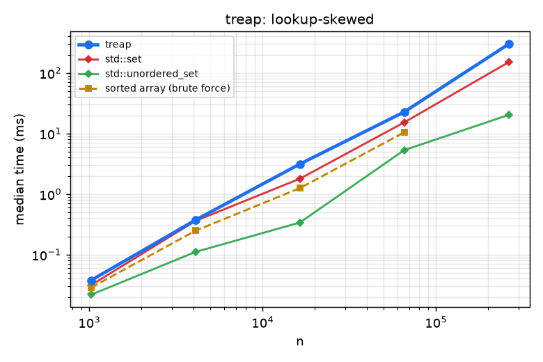
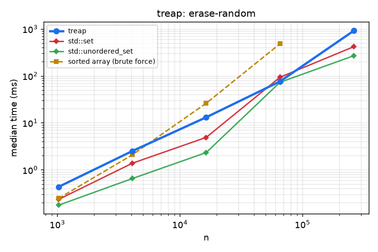

# Treap

A randomized balanced binary search tree (BST on keys, heap on random priorities) with order statistics (`kth`, `rank`, `lower_bound`).

## 1. Problem Statement

* **Input**: distinct keys under a strict weak order (`Compare`); operations `insert`, `erase`, `contains`, `lower_bound`, `kth`, `rank`.
* **Output**: set semantics plus rank queries; `rank(k)` counts keys $<k$ and `kth(i)` returns the $i$-th smallest (0-based).
* **Constraints**: at most $2^{32}-2$ keys (32-bit arena indices); the RNG seed makes the shape reproducible.

## 2. Algorithm Overview & Mathematical Model

Every node carries a uniformly random priority. A treap is the unique BST on the keys that is also a max-heap on priorities, which is exactly the BST obtained by inserting the keys in descending-priority order, i.e. in *random* order. Hence the expected depth of any key is $2H_n - O(1) = O(\log n)$ regardless of the insertion order, so sorted inputs (which wreck plain BSTs) are harmless.

Inserts restore heap order with rotations and erases merge the two child subtrees; subtree sizes are maintained for $O(\log n)$ expected `rank`/`kth`.

## 3. Complexity Analysis

| Operation / phase | Time | Space / notes |
| :--- | :--- | :--- |
| `insert`, `erase`, `contains`, `lower_bound` | $O(\log n)$ expected | $O(1)$ extra |
| `kth`, `rank` | $O(\log n)$ expected | uses subtree sizes |
| `to_vector` | $O(n)$ | |
| Storage | | $O(n)$ arena nodes |

## 4. Quickstart & Usage

Header-only; add `modules/data-structures/treap/include` to the include path (CMake target `treap`).

```cpp
#include "treap.hpp"

algo::Treap<int> t(/*seed=*/42);
t.insert(30); t.insert(10); t.insert(20);
t.contains(20);          // true
*t.kth(0);               // 10
t.rank(25);              // 2 keys are < 25
```

## 5. Empirical Benchmarks

Measured on an Intel Core i7-10750H @ 2.60 GHz (12 threads), 7 GiB RAM, GCC 11.5 `-O3`, single thread. Each cell is the median of 3-9 repetitions after one warm-up; inputs are seeded (`common/rng.hpp`) so every run sees identical data. Regenerate with `python3 tools/run_benchmarks.py && python3 tools/plot.py`.

**Strategies compared** (brute force, baseline, near-optimal heuristic and optimal/exact tiers, all on the same inputs):

| Tier | Strategy |
| :--- | :--- |
| Brute force | sorted array: binary-search lookup, $O(n)$ shifting insert/erase (shown up to $n=2^{16}$) |
| Baseline | `std::set` (red-black tree) |
| Non-ordered upper bound | `std::unordered_set` (hash table: fastest lookup, but no order queries) |
| This module | `treap` |

### Random inserts

<!-- BENCH:results/bench.csv workload=insert-random -->
| n | treap | std::set | std::unordered_set | sorted array (brute force) |
| ---: | ---: | ---: | ---: | ---: |
| 1,024 | 0.209 | 0.295 | 0.147 | 0.115 |
| 4,096 | 1.528 | 0.884 | 0.650 | 0.802 |
| 16,384 | 7.995 | 3.334 | 1.645 | 10.103 |
| 65,536 | 37.015 | 36.176 | 15.630 | 379.694 |
| 262,144 | 597.977 | 415.929 | 168.883 |  |

_Median wall time in milliseconds._
<!-- /BENCH -->

### Ascending inserts

<!-- BENCH:results/bench.csv workload=insert-sorted -->
| n | treap | std::set | std::unordered_set | sorted array (brute force) |
| ---: | ---: | ---: | ---: | ---: |
| 1,024 | 0.108 | 0.101 | 0.105 | 0.019 |
| 4,096 | 0.568 | 0.617 | 0.435 | 0.063 |
| 16,384 | 1.706 | 2.784 | 1.121 | 0.275 |
| 65,536 | 7.719 | 25.627 | 6.339 | 2.109 |
| 262,144 | 39.363 | 222.319 | 32.322 |  |

_Median wall time in milliseconds._
<!-- /BENCH -->

### Uniform lookups

<!-- BENCH:results/bench.csv workload=lookup-uniform -->
| n | treap | std::set | std::unordered_set | sorted array (brute force) |
| ---: | ---: | ---: | ---: | ---: |
| 1,024 | 0.078 | 0.064 | 0.019 | 0.070 |
| 4,096 | 0.642 | 0.606 | 0.131 | 0.388 |
| 16,384 | 3.859 | 3.583 | 0.398 | 1.357 |
| 65,536 | 28.590 | 34.364 | 4.177 | 10.444 |
| 262,144 | 639.124 | 341.216 | 42.237 |  |

_Median wall time in milliseconds._
<!-- /BENCH -->

### Skewed lookups (90% on the hottest 1% of keys)

<!-- BENCH:results/bench.csv workload=lookup-skewed -->
| n | treap | std::set | std::unordered_set | sorted array (brute force) |
| ---: | ---: | ---: | ---: | ---: |
| 1,024 | 0.038 | 0.031 | 0.022 | 0.029 |
| 4,096 | 0.373 | 0.361 | 0.111 | 0.249 |
| 16,384 | 3.132 | 1.793 | 0.339 | 1.254 |
| 65,536 | 22.693 | 15.250 | 5.316 | 10.450 |
| 262,144 | 298.568 | 150.111 | 20.236 |  |

_Median wall time in milliseconds._
<!-- /BENCH -->

### Insert all then erase all

<!-- BENCH:results/bench.csv workload=erase-random -->
| n | treap | std::set | std::unordered_set | sorted array (brute force) |
| ---: | ---: | ---: | ---: | ---: |
| 1,024 | 0.434 | 0.235 | 0.177 | 0.246 |
| 4,096 | 2.514 | 1.384 | 0.653 | 2.094 |
| 16,384 | 13.126 | 4.901 | 2.330 | 26.129 |
| 65,536 | 76.079 | 93.394 | 72.950 | 481.168 |
| 262,144 | 912.732 | 417.649 | 268.134 |  |

_Median wall time in milliseconds._
<!-- /BENCH -->

### Figures

Dashed lines are brute-force strategies, dotted lines are heuristics or approximations, solid bold is this module. Axes are log-log; quality plots show result divided by the exact/optimal reference (1.0 is optimal).

<!-- FIGURES:results/bench.csv -->
<table>
<tr><td width="50%"><br><sub>Median time per strategy for n random keys inserted one by one into an empty set (treap). Largest size n = 262,144: treap needs 598 ms against 169 ms for std::unordered_set. Source: data-structures/treap/results/bench.csv.</sub></td><td width="50%"><br><sub>treap: runtime on n keys inserted in ascending order into an empty set. At n = 262,144, treap takes 39.4 ms (rank 2 of 3); std::unordered_set is fastest at 32.3 ms. Source: data-structures/treap/results/bench.csv.</sub></td></tr>
<tr><td width="50%"><br><sub>Median time per strategy for n membership lookups for keys drawn uniformly from the stored set (treap). At n = 262,144, treap is slowest at 639 ms; std::unordered_set is fastest at 42.2 ms.</sub></td><td width="50%"><br><sub>Median time per strategy for n membership lookups where 90% of the queries hit the hottest 1% of the keys (treap). Largest size n = 262,144: treap needs 299 ms against 20.2 ms for std::unordered_set. Data: data-structures/treap/results/bench.csv.</sub></td></tr>
<tr><td width="50%"><br><sub>treap: runtime on n random keys inserted and then all erased in the same order. Both axes are logarithmic. Largest size n = 262,144: treap needs 913 ms against 268 ms for std::unordered_set.</sub></td><td width="50%"></td></tr>
</table>
<!-- /FIGURES -->

### Findings

* On random inserts and lookups the treap is up to about 2x slower than `std::set` (lookups at $n=2^{18}$: 0.64 s vs 0.34 s per million-key stream), while it **wins on ascending inserts** (about 5.6x faster than `std::set` at $n=2^{18}$) thanks to the arena layout.
* The sorted-array brute force is competitive only for lookups; its insert/erase cost explodes quadratically, which the log-log plots show as a slope near 2.
* The hash table is always fastest for pure membership. The treap's value is ordered queries (`kth`, `rank`, `lower_bound`) that `std::set` cannot answer in $O(\log n)$ (`std::set` has no `kth`).

Raw data: [`results/bench.csv`](results/bench.csv). Benchmark source: [`bench/treap_bench.cpp`](bench/treap_bench.cpp).

## 6. Correctness & Verification

The Catch2 suite (16 cases) compares random operations and order statistics against `std::set` and a sorted vector (300 seeds), sorted/reverse/organ-pipe insertion, erase in every order, seed determinism, slot reuse, and `check_invariants()` (BST order, max-heap on priorities, subtree sizes) after every operation. Statistical cases check the expected depth $H_k+H_{n-k+1}-2$ over 400 seeds, mean search cost against $2(1+1/n)H_n-3$ within 3%, balance after deleting 90% of the keys and a $10^6$-operation scale test.

```bash
cmake --preset debug-asan && cmake --build --preset debug-asan --target treap_test
./build/debug-asan/mod_treap/treap_test
```

## 7. Limitations & Trade-Offs

* Expected, not worst-case, bounds; a bad seed is possible but exponentially unlikely.
* Set only (no values); wrap a pair key for maps.
* Up to about 2x slower than `std::set` for random lookups in these runs.

## 8. References

* C. R. Aragon and R. Seidel, “Randomized search trees,” *Algorithmica* 16, 1996 (FOCS 1989).
* T. H. Cormen, C. E. Leiserson, R. L. Rivest, C. Stein, *Introduction to Algorithms*, 3rd ed., MIT Press, 2009.
