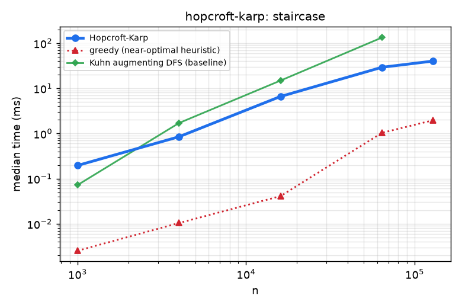
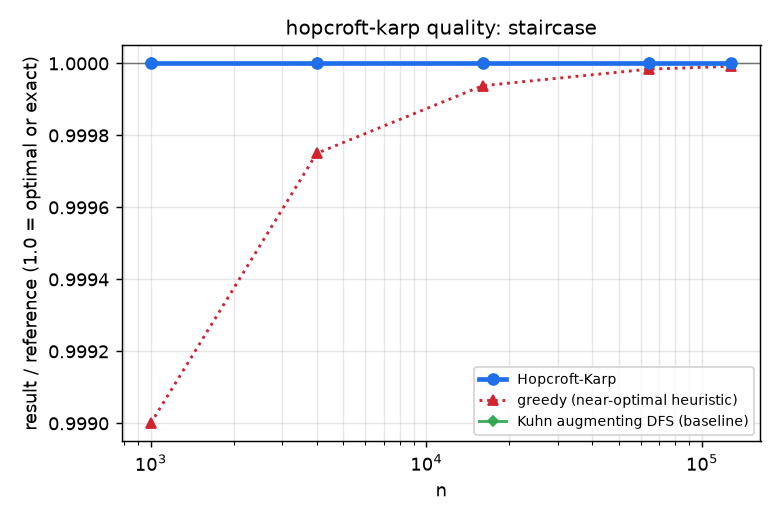

# Hopcroft-Karp bipartite matching

Maximum cardinality matching in $O(E\sqrt V)$ with a minimum vertex cover (König) certificate.

## 1. Problem Statement

* **Input**: a bipartite graph with left part $L$, right part $R$ and edges $E\subseteq L\times R$.
* **Output**: a maximum matching (`left_match`, `right_match`) and a minimum vertex cover of the same size.
* **Constraints**: vertices are integers in `[0, size)`; parallel edges allowed.

## 2. Algorithm Overview & Mathematical Model

Repeat phases: a BFS from all free left vertices builds a layered graph; a DFS then finds a **maximal set of vertex-disjoint shortest augmenting paths**. After $i$ phases the shortest augmenting path has length $\ge 2i+1$, and if $M^*$ is maximum, $|M^*|-|M|\le |V|/(i+1)$, so $O(\sqrt V)$ phases suffice, each $O(E)$. The minimum vertex cover follows from König's theorem: take vertices reachable from free left vertices by alternating paths, $C=(L\setminus Z)\cup(R\cap Z)$.

## 3. Complexity Analysis

| Operation / phase | Time | Space / notes |
| :--- | :--- | :--- |
| Phase (BFS + DFS) | $O(E)$ | $O(V)$ |
| Number of phases | $O(\sqrt V)$ | |
| Total | $O(E\sqrt V)$ | $O(V+E)$ |

## 4. Quickstart & Usage

Header-only; add `modules/graph-flow/hopcroft-karp/include` to the include path (CMake target `hopcroft_karp`).

```cpp
#include "hopcroft_karp.hpp"

algo::HopcroftKarp hk(/*left=*/3, /*right=*/3);
hk.add_edge(0, 0); hk.add_edge(0, 1); hk.add_edge(1, 1); hk.add_edge(2, 1); hk.add_edge(2, 2);
int m = hk.maximum_matching();       // 3
auto cover = hk.min_vertex_cover();  // size 3, covers every edge
```

## 5. Empirical Benchmarks

Measured on an Intel Core i7-10750H @ 2.60 GHz (12 threads), 7 GiB RAM, GCC 11.5 `-O3`, single thread. Each cell is the median of 3-9 repetitions after one warm-up; inputs are seeded (`common/rng.hpp`) so every run sees identical data. Regenerate with `python3 tools/run_benchmarks.py && python3 tools/plot.py`.

**Strategies compared** (brute force, baseline, near-optimal heuristic and optimal/exact tiers, all on the same inputs):

| Tier | Strategy |
| :--- | :--- |
| Near-optimal heuristic | greedy one-pass matching (no augmentation) |
| Baseline | Kuhn's augmenting-path DFS, $O(VE)$ |
| Optimal | Hopcroft-Karp |

Workloads: random left-degree-3 graphs (near the matching phase transition, long augmenting paths) and a "staircase" (left $i$ adjacent to right $i$ and $i+1$). `n` is the size of each side. Kuhn is omitted at $n>64000$ because of its runtime.

### Random left-degree-3 graphs

<!-- BENCH:results/bench.csv workload=random-deg3 -->
| n | Hopcroft-Karp | greedy (near-optimal heuristic) | Kuhn augmenting DFS (baseline) |
| ---: | ---: | ---: | ---: |
| 1,000 | 0.570 | 0.007 | 3.513 |
| 4,000 | 2.192 | 0.044 | 71.913 |
| 16,000 | 17.336 | 0.195 | 1457.448 |
| 64,000 | 82.951 | 1.216 | 59895.567 |
| 128,000 | 188.228 | 5.039 |  |

_Median wall time in milliseconds._
<!-- /BENCH -->

### Matching size / optimum (higher is better)

<!-- BENCH:results/bench.csv workload=random-deg3 value=ratio -->
| n | Hopcroft-Karp | greedy (near-optimal heuristic) | Kuhn augmenting DFS (baseline) |
| ---: | ---: | ---: | ---: |
| 1,000 | 1.000 | 0.874 | 1.000 |
| 4,000 | 1.000 | 0.872 | 1.000 |
| 16,000 | 1.000 | 0.878 | 1.000 |
| 64,000 | 1.000 | 0.877 | 1.000 |
| 128,000 | 1.000 | 0.876 |  |

_ratio (see the `extra` column of the CSV)._
<!-- /BENCH -->

### Staircase

<!-- BENCH:results/bench.csv workload=staircase -->
| n | Hopcroft-Karp | greedy (near-optimal heuristic) | Kuhn augmenting DFS (baseline) |
| ---: | ---: | ---: | ---: |
| 1,000 | 0.195 | 0.003 | 0.072 |
| 4,000 | 0.845 | 0.010 | 1.701 |
| 16,000 | 6.580 | 0.041 | 14.811 |
| 64,000 | 29.177 | 1.032 | 132.738 |
| 128,000 | 39.917 | 1.948 |  |

_Median wall time in milliseconds._
<!-- /BENCH -->

### Figures

Dashed lines are brute-force strategies, dotted lines are heuristics or approximations, solid bold is this module. Axes are log-log; quality plots show result divided by the exact/optimal reference (1.0 is optimal).

<!-- FIGURES:results/bench.csv -->
<table>
<tr><td width="50%"><br><sub>random-deg3 (results/bench.csv)</sub></td><td width="50%"><br><sub>staircase (results/bench.csv)</sub></td></tr>
<tr><td width="50%"><br><sub>random-deg3 quality (results/bench.csv)</sub></td><td width="50%"><br><sub>staircase quality (results/bench.csv)</sub></td></tr>
</table>
<!-- /FIGURES -->

### Findings

* **Hopcroft-Karp is about 84x faster than Kuhn at $n=16000$ and about 720x faster at $n=64000$** on random degree-3 graphs (83 ms vs 59.9 s): Kuhn's $O(VE)$ behaviour is visible, with a slope well above 1 on the log-log plot.
* The greedy heuristic is another 37-90x faster but only reaches **87.6%** of the optimum on the random graphs, as expected from a 1/2-approximation that is usually much better in practice.
* On the staircase the greedy solution is accidentally near-optimal (ratio 0.99999) and Kuhn is only 4.5x slower: this workload is *not* adversarial for them, a limitation of this sweep.

Raw data: [`results/bench.csv`](results/bench.csv). Benchmark source: [`bench/hopcroft_karp_bench.cpp`](bench/hopcroft_karp_bench.cpp).

## 6. Correctness & Verification

The Catch2 suite (16 cases) covers the textbook matching, empty sides and isolated vertices, invalid endpoints, complete bipartite graphs, Hall-deficient graphs, random small graphs against brute-force augmenting paths, symmetric match arrays, König's theorem (cover size equals matching size and covers every edge), label permutation invariance, an alternating-layer adversary needing multiple BFS phases, idempotent repeated calls and monotonicity under added edges.

```bash
cmake --preset debug-asan && cmake --build --preset debug-asan --target hopcroft_karp_test
./build/debug-asan/mod_hopcroft-karp/hopcroft_karp_test
```

## 7. Limitations & Trade-Offs

* Cardinality only; no weights (use `min-cost-flow` for weighted assignment).
* The staircase workload does not stress the baselines.
* The augmenting DFS is recursive; its depth is bounded by the length of an augmenting path.

## 8. References

* J. E. Hopcroft and R. M. Karp, “An $n^{5/2}$ algorithm for maximum matchings in bipartite graphs,” *SIAM J. Comput.* 2(4), 1973.
* D. König, 1931 (minimum vertex cover = maximum matching in bipartite graphs).
